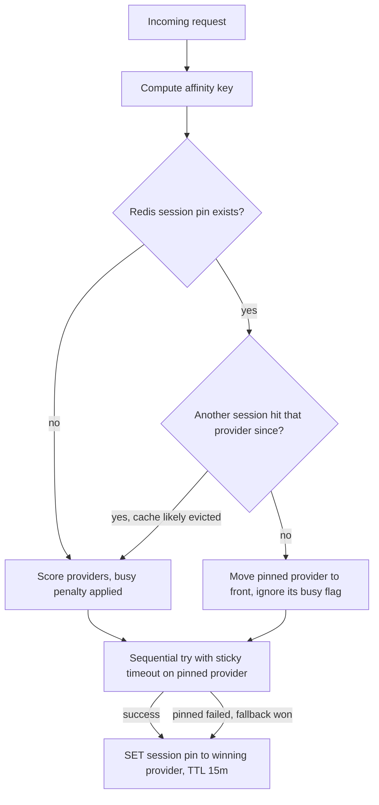

# KV-Cache-Aware Sticky Routing

Route follow-up turns of the same conversation to the provider that already holds the
KV cache. Redis (new infra component) holds all ephemeral routing state: session pins,
provider busy flags, and last-session tracking for the eviction heuristic. Includes
busy-aware queueing signals to the provider client and a longer timeout for sticky
requests.

## Current state (verified in both repos)

### inferoute-node (this repo)

- Every request independently queries health, scores, and picks top-10 providers —
  `selectBestProviders` in `pkg/api/orchestrator/service.go` (L611–672). Zero memory of
  prior turns.
- `sendRequestToProvider` (L830–936) already does sequential failover across the ranked
  list — reused as the safety net for soft pinning.
- `is_busy` arrives in every health push (`GPUInfo.IsBusy`,
  `pkg/api/provider/models.go` L106) but is never persisted or used in routing.
- Timeout is a flat 30s at both orchestrator→provider-comm and provider-comm→provider
  (`pkg/common/http.go` L89, `pkg/api/provider_comm/service.go` L29).
- No Redis today. Decision: add Redis for ephemeral routing state. It is loss-tolerant
  hint data — a Redis restart just means cache-miss re-prefills — so a single instance
  is acceptable for the 3-server cluster. CockroachDB keeps all durable state (health
  status, history, models, billing) unchanged.

### inferoute-client (separate repo, `Inferoute/inferoute-client`)

- `handleInference` (`pkg/server/handler.go` L66–133) rejects with an immediate
  **503 "GPU is busy"** when either the inflight slot count is at
  `max_concurrent_inference` (default **1**, atomic counter in
  `pkg/server/inflight.go`) or NVIDIA GPU utilization is **> 20%**
  (`pkg/gpu/monitor.go` ~L150). No queueing of any kind.
- The util check means a provider looks busy while still decoding the previous turn —
  exactly the window in which an agent's next turn arrives. Without client changes,
  pinned requests get 503'd and fail over to a cold GPU, discarding the KV cache
  precisely when it is most valuable.
- Only `X-Request-Id` (HMAC) is read from headers; `X-Model-Name` is sent by
  provider-comm but unread — model comes from the JSON body.
- Client-side timeouts cap everything at 30s: HTTP server `ReadTimeout`/`WriteTimeout`
  (`pkg/server/server.go` L104–105) and the vLLM/Ollama forward clients
  (`pkg/llm/vllm.go` L27, `pkg/llm/ollama.go` L43). Responses are fully buffered — no
  streaming proxy.
- Health `is_busy` is GPU-util-only (the inflight counter is not included) and is
  pushed every **3 minutes** (`ReportInterval`, `pkg/health/reporter.go` L43), so the
  central busy signal is minutes stale.

## Design

### 1. Redis infrastructure (new)

- Add `redis:7-alpine` to `docker/compose/docker-compose.yml`, dev, and prod variants.
  No persistence (`--save ''` — the data is hints); `maxmemory` + `allkeys-lru` so it
  can never grow unbounded.
- Config in `internal/config/config.go`: `RedisHost`, `RedisPort`, `RedisPassword`
  following the existing flat viper pattern.
- New `internal/redis/redis.go`: thin wrapper around `github.com/redis/go-redis/v9`,
  constructor-injected like `internal/db`. Connected by the orchestrator and
  provider-health services only.
- Fail open: if Redis is down, log a warning and route exactly as today (no pin, no
  busy penalty). Redis must never be able to take inference down.

### 2. Affinity key (conversation fingerprint)

New `pkg/api/orchestrator/affinity.go`:

- Explicit key wins: add `SessionID string` (`json:"session_id,omitempty"`) to
  `InferouteOptions` (`pkg/api/orchestrator/models.go` L30) — already stripped before
  provider calls via `delete(reqMap, "inferoute")`.
- Automatic fallback:
  `SHA-256(consumer_id | model | system message content | first user message content)`
  (first 2KB of each). For `prompt`-style requests, hash the first 2KB of the prompt.
  Stable across every turn of an agent conversation (system prompt + first message
  never change), so no hash-chain bookkeeping. Two parallel conversations with
  identical openings collide, but they share the KV prefix anyway — harmless.
- If `messages` and `prompt` are both empty-ish, no key → routing behaves exactly as
  today.

### 3. Redis key schema (AffinityStore)

`pkg/api/orchestrator/affinity_store.go` — small interface (`Lookup`, `Pin`,
`BusyFlags`) backed by Redis:

| Key | Value | TTL | Written by |
|-----|-------|-----|------------|
| `session:{affinity_key}` | provider_id | 15m, refreshed on each pin | orchestrator, after winner known |
| `provider_last_session:{provider_id}` | affinity_key | 15m | orchestrator, same moment |
| `provider_busy:{provider_id}` | `1`/`0` | 2× health push interval | provider-health consumer |

- Native TTL replaces any cleanup job and TTL-check-on-read entirely — no migration,
  no cron.
- Pin is a `MULTI`: `SET session:… EX 900` + `SET provider_last_session:… EX 900`.
- Eviction heuristic (KV-overwrite on vLLM/Ollama): on lookup,
  `GET provider_last_session:{pinned_provider}` — if it holds a *different* affinity
  key, another conversation hit that GPU since our last turn and our KV cache is
  likely evicted → skip the pin, route normally. Pessimistic for large-VRAM providers
  that cache several sessions; gated behind `SESSION_AFFINITY_EVICTION_CHECK`
  (default on). Also: `SESSION_AFFINITY_ENABLED` (default true),
  `SESSION_AFFINITY_TTL` (default 15m).

### 4. Routing integration in `ProcessRequest`

In `pkg/api/orchestrator/service.go`, after `selectedProviders` is built (~L224):

- Look up the affinity key in Redis. If the pinned provider is present in
  `selectedProviders` (still healthy, priced within limits, verified), move it to
  index 0. Soft pin, not hard pin — the existing failover loop is the safety net.
- If the pinned provider is not in the candidate list (went red, paused, repriced out
  of budget), ignore the pin; the winner of this request re-pins.
- After `sendRequestToProvider` returns a winner (L266), pin the session → winner.
  Covers both "pinned provider succeeded" and "pinned failed, fallback won — re-pin to
  fallback", which also makes consumer-harness re-requests land on the right provider
  automatically.

### 5. Busy state: Redis only, never the DB

- Provider-health consumer (`processHealthCheck` in `pkg/api/health/service.go` ~L304)
  additionally does `SET provider_busy:{id} <gpu.is_busy> EX <2× push interval>`. No
  `providers.is_busy` column, no change to `FilterProviders` SQL, no write
  amplification in CockroachDB — busy is stale-in-seconds data with no historical
  value.
- Orchestrator reads busy flags with one `MGET` over the ≤20 candidate provider IDs
  after the health filter returns.
- In `selectBestProviders`, apply a score penalty to busy providers for non-sticky
  traffic so fresh conversations prefer idle GPUs. An expired/missing busy key counts
  as not busy (provider idle or dead; the existing 5-minute CRDB stale check already
  handles dead).
- For the pinned provider, ignore busy: sending the same session to its busy provider
  is the queue-at-provider behavior — the client queues/serializes it, and
  same-session turns are serial by nature anyway.
- Known limitation until the client ships change C3 below: the busy flag lags by up to
  the 3-minute push interval. The penalty still helps steer fresh conversations away
  from long-running work; it is a hint, not a gate.

### 6. Queue-at-provider signal (`X-Session-Key` contract)

- Provider-comm already forwards `X-Request-ID`/`X-Model-Name`
  (`pkg/api/provider_comm/service.go` L50–51). Add `X-Session-Key: <affinity_key>`,
  plumbed through the `providerReq` map from the orchestrator.
- Contract for the client (see client changes below): when busy, compare incoming
  `X-Session-Key` to the in-flight/last-served one — matching key ⇒ hold the request
  until the slot frees (bounded wait); different or missing key ⇒ 503 as today so the
  orchestrator fails over.

### 7. Sticky timeout

- New `ProviderStickyInferenceTimeout()` in `pkg/common/http.go`
  (`PROVIDER_STICKY_INFERENCE_TIMEOUT`, default 120s) — covers queueing wait at the
  pinned provider; the flat 30s stays for cold attempts.
- Plumbing: `sendRequestToProvider` passes the sticky timeout only for the pinned
  provider attempt (index 0 when pinned). Provider-comm currently uses a client-level
  `Timeout` (L28–30) which caps everything at 30s regardless — switch to a per-request
  `context.WithTimeout` using a `timeout_ms` field in the send-request payload,
  falling back to the current default.
- Note: the sticky timeout is only effective once the client raises its own 30s
  ceilings (client change C2). Until then sticky attempts are still capped at ~30s
  end-to-end.

### 8. Tests

- Unit tests for fingerprint stability (same conversation across turns → same key;
  different model/consumer → different key; multimodal content via `GetContent`).
- AffinityStore tests against `miniredis` (in-process, no container needed):
  pin/lookup round-trip, TTL expiry, eviction check, fail-open on connection error.
- Service tests: pin promotes provider to front; missing/evicted pin falls through;
  failed pinned provider re-pins to fallback winner; busy penalty applies only to
  non-sticky candidates.

## Required inferoute-client changes (separate repo)

The central-plane work above ships value on its own (warm-path pinning when the
provider is idle), but the full design needs three client changes:

### C1. Session-aware queueing instead of blanket 503 (required)

`pkg/server/handler.go` `handleInference` (L66–133) + `pkg/server/inflight.go`:

- Read `X-Session-Key` alongside `X-Request-Id`.
- Track the session key of the in-flight/last-completed request (single field guarded
  by the existing atomic/CAS pattern; `max_concurrent_inference` default is 1 so this
  is one slot).
- If busy and the incoming key **matches** → wait for the inflight slot with a bounded
  wait (60–90s, configurable) instead of immediate 503. Same-session turns are serial,
  so this queue has depth 1 in practice.
- Different key or no key → 503 immediately, exactly as today (orchestrator fails
  over).
- The pre-auth `isBusy()` check at L69–78 must also become session-aware, since its
  GPU-util>20% arm (`pkg/gpu/monitor.go` ~L150) fires while the previous turn of the
  *same* session is still decoding — the most common sticky case.

### C2. Raise the 30s timeout ceilings (required for sticky timeout)

- HTTP server `ReadTimeout`/`WriteTimeout` 30s → align with the central sticky
  timeout + queue wait (`pkg/server/server.go` L104–105).
- vLLM/Ollama forward clients 30s → configurable, same alignment (`pkg/llm/vllm.go`
  L27, `pkg/llm/ollama.go` L43).

### C3. Fresher busy reporting (recommended, not blocking)

- Include the inflight-slot state in the health report's `is_busy` (currently
  GPU-util-only, `pkg/health/reporter.go` ~L303–358).
- Push a health report immediately on busy-state transitions instead of only on the
  3-minute tick (`ReportInterval`, L43) so the central `provider_busy` flag is
  seconds, not minutes, stale.

## Explicitly out of scope

- Redis HA (Sentinel/Cluster). Single instance is acceptable because all data is
  loss-tolerant hints and the code fails open; revisit if Redis gains
  correctness-critical tenants.
- Prefix-hash chain matching / KV-event-aware routing (real-time VRAM block index).
  The stable-fingerprint approach gets ~all the win for agent loops at a fraction of
  the complexity; chain matching can be layered on later without schema changes.
- Mid-stream failover, and a streaming proxy in the client (the client currently
  buffers full responses — a separate issue worth its own task).

## Files touched (this repo)

- `internal/redis/redis.go` (new), `internal/config/config.go`
- `pkg/api/orchestrator/affinity.go` (new), `affinity_store.go` (new), `service.go`,
  `models.go`
- `pkg/api/health/service.go` (busy flag → Redis)
- `pkg/api/provider_comm/service.go`, `models.go`
- `pkg/common/http.go`
- `docker/compose/docker-compose.yml`, `docker-compose.dev.yml`,
  `docker-compose.prod.yml`
- `go.mod` (`github.com/redis/go-redis/v9`, `miniredis` test dep)
- `documentation/technical.md` (X-Session-Key contract for inferoute-client)
