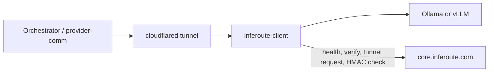

# Inferoute Provider Client — technical overview

Audience: **technical managers**. This is the GPU-side daemon (`inferoute-client`): tunnel, health, model verification, and the HMAC-gated OpenAI proxy in front of local Ollama or vLLM.

Operator/product narrative: [overview.md](overview.md). Platform routing, billing, and verify-judge: **inferoute-node** `documentation/technical.md`. Sticky-routing design: [plans/kv-cache-sticky-routing.md](plans/kv-cache-sticky-routing.md). Customer install: inferoute-docs `provider-client/`.

## Role in the system

The client is not an inference engine. It is the Inferoute **cluster agent**:

- Requests a Cloudflare tunnel and supervises `cloudflared`
- Pushes health (models, GPU, tunnel URL — **never geolocation**)
- Measures local weights; platform **judges** allowlisted aliases
- Registers models + default prices
- Accepts only HMAC’d `/v1/chat/completions` and `/v1/completions`, forwards to localhost LLM
- Serializes work (default 1 in-flight). Same-conversation follow-ups **queue**; everyone else gets **503** so the orchestrator fails over

Entry: `cmd/main.go`. Standalone `inferoute-client compatibility` exits before any of the above.

## Package layout

| Package | Role |
|---------|------|
| `internal/config` | YAML load and defaults |
| `pkg/server` | HTTP, console/HTML UI, HMAC, session queue, proxy |
| `pkg/health` | Assemble + push health; busy-transition reports |
| `pkg/llm` | Ollama / vLLM (`ListModels`, `ForwardRequest`) |
| `pkg/gpu` | NVIDIA `nvidia-smi` (Linux/Windows, ~1s cache); basic info on macOS. Windows spawn uses `CREATE_NO_WINDOW` so the console does not flash. |
| `pkg/compat` | Pre-flight hardware vs catalog scoring |
| `pkg/cloudflare` | Tunnel request + `cloudflared` supervision. Invalid provider API key → `ErrInvalidAPIKey` (**401** from the platform). |
| `pkg/tray` | Windows notification area; stub elsewhere |
| `pkg/pricing` | Market prices + `POST /api/provider/models` |
| `pkg/verify` | Catalog fetch, local measure, cache, inference gate |
| `pkg/logger` | Zap + lumberjack rotation |
| `pkg/usermsg` | Operator-facing error strings |

## Startup

`compatibility` subcommand: `pkg/compat` only — no config, no API key, no server.

Daemon:

1. Config `--config` or `~/.config/inferoute/config.yaml`
2. Logger, optional GPU monitor, LLM client
3. `GET /api/models/approved-builds`
4. Verifier + pricing registration
5. HTTP server; `POST /api/cloudflare/tunnel/request`; start `cloudflared`. Invalid API key → process exits with an operator-facing message (not a raw 500).
6. Health loop (`ReportInterval` = **3 minutes**): wait up to 30s for tunnel URL, initial push, then ticker **and** busy-edge pushes (10s cooldown)

Windows: tray is default; process detaches so closing PowerShell does not kill it. `--console` for the TUI.

## Configuration

| Section | Fields that matter |
|---------|-------------------|
| `server` | `port` (8080), `host` (`127.0.0.1`; set `0.0.0.0` only for LAN/Docker host dashboard), `max_concurrent_inference` (**1**; `0` = unlimited), `session_queue_wait_seconds` (**90**), `request_timeout_seconds` (**240** — must cover queue + inference) |
| `provider` | `api_key`, `url` (platform base), `provider_type` (`ollama` \| `vllm`), `llm_url`, `llm_timeout_seconds` (**120**, matches platform sticky timeout), optional `hf_hub_cache` / `model_path` |
| `logging` | level, `log_dir`, rotation |

`TunnelServiceURL()` is `http://localhost:<port>` when host is loopback or `0.0.0.0`. No Cloudflare block in YAML — token comes from the platform. Platform tunnel ingress forwards only `/v1/chat/completions` and `/v1/completions`.

## Inference path (`handleInference`)

Order is load-bearing:

1. Require `X-Request-Id` (reject missing or >256 bytes) and `POST /api/provider/validate_hmac`. Fail → **401**. No GPU query yet.
2. Read `X-Session-Key`. If it matches the in-flight/last session → **skip** the busy reject (GPU util >20% fires while the previous turn of *this* chat is still decoding).
3. Else: 503 if in-flight cap reached **or** NVIDIA util > 20% (`nvidia-smi` cached ~1s).
4. Parse `model`; `CheckInference` must be `verification_status == verified` for allowlisted aliases.
5. Same session → `acquireInferenceWait` up to `session_queue_wait_seconds`; other → `tryAcquireInference`. Fail → 503.
6. `forwardToLLM`, write **entire** body, release slot.

**No streaming proxy.** Orchestrator has SSE plumbing; this process buffers. Treat consumer `stream=true` as unsupported until this changes.

Timeout alignment: platform pinned attempt 120s; client LLM forward 120s; HTTP read/write 240s.

### X-Session-Key contract

Platform affinity key (see node technical). Client tracks one active key (`max_concurrent_inference` default 1 ⇒ queue depth 1).

| Incoming key vs busy | Behavior |
|----------------------|----------|
| Match | Wait for slot (bound 90s), skip GPU-util busy |
| Different or missing | Immediate 503 → orchestrator failover |
| Wait expires | 503 |

## Health

- Interval: 3 min + **immediate on busy flip** (buffered, 10s cooldown) so Redis `provider_busy` is seconds-stale, not minutes.
- `is_busy`: GPU util > 20% **or** all inference slots taken (macOS / util- lag path).
- Payload: models (with verification fields), GPU block, `cloudflare.url`, `provider_type`.
- Per cycle: refresh catalog → `ListModels` → `ApplyToModels` → register newly verified → `POST /api/provider/health`.
- Local: `GET /api/health`, `GET /api/busy`.

Platform persists GPU/tunnel, publishes RabbitMQ, resolves **country from tunnel `origin_ip`** — not from this payload.

## Verification (`pkg/verify`)

Server-as-judge. Client measures; never learns expected hashes.

| Engine | Measure | POST |
|--------|---------|------|
| Ollama | digest + size `/api/tags` | `/api/provider/verify-model` |
| vLLM | SHA256 of weights under HF cache or `model_path` | same |

Result cache **10 min** per alias; invalidate on digest/size change, vLLM file stats, catalog fingerprint, or TTL. vLLM also caches fingerprints to skip re-hash. Console redraw (3s) must not hammer verify — it reads `GetDisplayedModels()` from the last health snapshot.

Public catalog includes `min_size_bytes` for the compatibility command; it must not include digests/manifests.

**Honest-client guarantee only.** A forked client can lie. Node Phase 2 is live canaries.

## Compatibility command (`pkg/compat`)

No daemon, no key. Default catalog `https://core.inferoute.com`. `--provider-type`, `--json`, `--catalog-url`, `--offline-catalog`.

Memory for scoring: largest single NVIDIA GPU VRAM; Apple Silicon 65% of unified RAM; else 70% of system RAM with a CPU-path warning. Multi-GPU does **not** aggregate.

Required = `min_size_bytes` × overhead (Ollama 1.25, vLLM 1.50, unknown 1.35).

| Ratio | Status |
|-------|--------|
| `< 0.50` | `runs_well` |
| `< 0.75` | `fits` |
| `< 0.95` | `tight` |
| `>= 0.95` | `too_large` |

Fit only — not tokens/sec.

## Pricing

Startup: list models → `POST /api/model-pricing/get-prices` → `POST /api/provider/models` (per-token). Health cycle registers newly verified models (HTTP 400 “already exists” → mark tracked). Dashboard later edits $/1M; this API is $/token.

## Tunnel (`pkg/cloudflare`)

`POST /api/cloudflare/tunnel/request` with `service_url` → `token` + `hostname` → `cloudflared tunnel run --token`. Supervise every **10s**, restart with backoff (max 30s). `cloudflared` must be on PATH (install scripts install it).

## HTTP surface

| Method | Path | Purpose |
|--------|------|---------|
| GET | `/` | HTML status (same snapshot as TUI) |
| GET | `/api/status` | JSON snapshot |
| GET | `/api/health` | Health report |
| GET | `/api/busy` | GPU/slot busy |
| POST | `/v1/chat/completions` | Proxy |
| POST | `/v1/completions` | Proxy |

TUI redraw 3s. Windows tray “Open dashboard” → `http://127.0.0.1:<port>/`. Operator routes (`/`, `/api/*`) are local-only; the tunnel forwards only the two inference POSTs.

## Platforms

| Platform | GPU detail | Busy |
|----------|------------|------|
| Linux + NVIDIA | Full `nvidia-smi` | Util >20% + in-flight cap |
| Windows amd64 + NVIDIA | `nvidia-smi` | Same |
| macOS | `system_profiler` | In-flight cap only (`IsBusy()` util always false) |
| No monitor | Placeholders in health | In-flight cap |

Client keeps running without GPU data. Compat probes can still score RAM.

## Deploy

- Install scripts: `scripts/install.sh`, macOS/Windows variants; Docker `Dockerfile` + `scripts/entrypoint.sh`
- Docker: LLM must bind `0.0.0.0`; `LLM_URL=http://host.docker.internal:<port>`. Client default bind is `127.0.0.1` — tunnel does not need a published port. Host dashboard requires `server.host: 0.0.0.0` plus `-p 127.0.0.1:8080:8080`.
- Binary config default `~/.config/inferoute/config.yaml`

## Cross-repo contracts

| Topic | Owner |
|-------|--------|
| HMAC validate, verify-model judge, health ingest, tunnel tokens | inferoute-node |
| Affinity key + Redis pin + sticky 120s timeout | inferoute-node orchestrator |
| `X-Session-Key` queue vs 503 | this client |
| Cluster country | node cloudflare-service from `origin_ip` |

If you change the session-queue wait, also change platform `PROVIDER_STICKY_INFERENCE_TIMEOUT` and this client’s `llm_timeout_seconds` / `request_timeout_seconds`.
