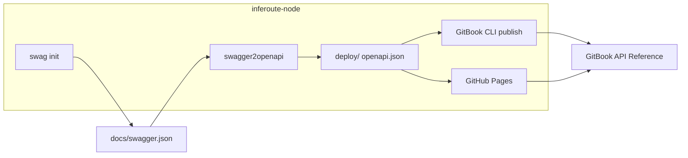
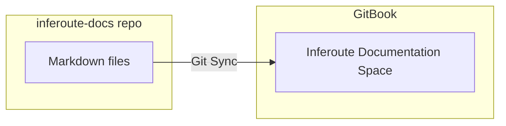

# Move documentation to GitBook (OpenAPI 3 only)

**Approach: Option B (Git Sync).** All prose documentation lives in a dedicated **inferoute-docs** repository as Markdown. GitBook syncs from that repo so edits in Git (and PR-based reviews) update the published docs. API reference in GitBook comes from the **OpenAPI 3** spec only (published from inferoute-node CI). **No Swagger UI or spec is served by the orchestrator**—everything lives on GitBook.

---

## Current state

- **inferoute-node:** Swag generates Swagger 2.0 (`docs/swagger.json` / `swagger.yaml`). [.github/workflows/docs.yml](inferoute-node/.github/workflows/docs.yml) runs `swag init`, copies `swagger.json` to `deploy/openapi.json`, and publishes `deploy/` to **GitHub Pages**. The orchestrator currently serves Swagger UI at `/swagger/*`—**this will be removed**; API docs live only on GitBook.
- **inferoute-client:** Contains README, `documentation/technical.md`, `documentation/faq.md`, and `docs/` (override.md, ollama.md, vllm.md, linux.md). This is the source material for writing the new docs in inferoute-docs.
- **GitBook:** Supports **OpenAPI 3.0 and 3.1** only; the spec is Swagger 2.0 today, so conversion to OpenAPI 3 is required before publishing to GitBook.

---

## 1. Convert to OpenAPI 3 and publish to GitBook only

GitBook's OpenAPI blocks only accept OpenAPI 3.0/3.1. Add a conversion step in inferoute-node's docs workflow and publish the result to GitBook. Optionally keep publishing the same file to GitHub Pages for a stable URL.

**Approach:** In the existing docs workflow (or a dedicated job):

- After `swag init`, convert `docs/swagger.json` → OpenAPI 3.x using **swagger2openapi** (e.g. `npx swagger2openapi docs/swagger.json -o deploy/openapi.json`).
- Use `deploy/openapi.json` as the single artifact: **GitHub Pages** = optional canonical URL for the spec; **GitBook** = consume via CLI publish (or URL).
- **Do not** serve Swagger UI or any spec from the orchestrator; all API docs live on GitBook.

**Artifacts:**

- `deploy/openapi.json` = OpenAPI 3.x (for GitBook and optionally GitHub Pages).

**Relevant file:** inferoute-node/.github/workflows/docs.yml

---

## 2. Publish OpenAPI spec to GitBook from GitHub

**Use CI publish (recommended):** After generating and optionally publishing to Pages, run the **GitBook CLI** in the same workflow to push the spec so GitBook updates on every merge to `main`.

Add a job (or steps) that:

- Uses the same trigger/paths as the current docs workflow (or runs after the job that produces `deploy/openapi.json`).
- Sets `GITBOOK_TOKEN` (secret), `GITBOOK_SPEC_NAME`, and `GITBOOK_ORGANIZATION_ID` (vars or secrets).
- Runs: `npx -y @gitbook/cli@latest openapi publish --spec "<spec_name>" --organization "<org_id>" deploy/openapi.json`

**Files to add/change:** inferoute-node/.github/workflows/docs.yml: add Node step for conversion (swagger2openapi), then GitBook publish step.

**Secrets/vars in GitHub (inferoute-node repo):**

- `GITBOOK_TOKEN` (secret)
- `GITBOOK_SPEC_NAME` (e.g. "Inferoute API")
- `GITBOOK_ORGANIZATION_ID` (from GitBook org settings)

**Note:** `GITBOOK_TOKEN` is also defined in inferoute-node’s Docker env files: `docker/env/production.env` and `docker/env/development.env` (for local/CI use; GitHub Actions should use the repo secret).

---

## 3. Create inferoute-docs repo and write documentation (Option B)

All prose lives in a dedicated **inferoute-docs** repo. Connect GitBook via **Git Sync** (Configure → GitHub Sync → select inferoute-docs repo and branch). Edits in Git update GitBook; versioning and PR-based reviews apply.

### 3.1 Documentation writing plan: files to create in inferoute-docs

Create the following structure in the inferoute-docs repo. Each file is Markdown; content is derived from inferoute-client as indicated.

| File in inferoute-docs | Source / content |
|------------------------|------------------|
| **README.md** or **overview.md** | **What is Inferoute** – New: 1–2 paragraphs (orchestrator, provider network, OpenAI-compatible API, core.inferoute.com). Derive from inferoute-node README and orchestrator role. |
| **provider-client/introduction.md** | inferoute-client/README.md: purpose, requirements, Cloudflare tunnel summary (Exposing your machine via Cloudflare). |
| **provider-client/how-it-works.md** | Condensed from inferoute-client/documentation/technical.md: components (config, GPU, health, ollama, server, logger); health monitoring and reporting (5 min cycle, nvidia-smi / system_profiler, /health, /busy); model pricing init and automatic model registration; inference request handling (GPU busy check, HMAC validation, proxy to Ollama/vLLM); Cloudflare tunnel lifecycle (request token, run cloudflared, refresh). |
| **provider-client/installation.md** | inferoute-client/README.md: Quick Start (install script, env vars), Docker (run, Compose, build from source), launch command and config path. |
| **provider-client/configuration.md** | inferoute-client/README.md: Configuration section (server, provider, cloudflare, logging; log file locations). Plus inferoute-client/docs/override.md: override defaults (PROVIDER_TYPE, LLM_URL, SERVER_PORT) for install script and Docker. |
| **provider-client/setup-ollama.md** | inferoute-client/docs/ollama.md (Ollama setup for provider). |
| **provider-client/setup-vllm.md** | inferoute-client/docs/vllm.md (vLLM setup for provider). |
| **provider-client/setup-linux.md** | inferoute-client/docs/linux.md (Linux/NVIDIA setup). |
| **provider-client/faq.md** | Shortened inferoute-client/documentation/faq.md. **Fix:** Replace all NGROK references with **Cloudflare Tunnel** (tunnel request, URL from platform, no manual URL update). Keep: What is the client, platforms, config, model auto-registration, pricing, GGUF, health frequency, inference handling. |
| **provider-client/rest-api.md** | inferoute-client/README.md: GET /api/health, GET /api/busy (local REST API). |

**API Reference** in GitBook is not a file in inferoute-docs; it is generated by GitBook from the OpenAPI spec (add OpenAPI Reference in TOC).

### 3.2 Suggested GitBook TOC (matches structure above)

- Overview (What is Inferoute)
- Provider client
  - Introduction
  - How it works
  - Installation
  - Configuration
  - Setup: Ollama / vLLM / Linux (or link to these as sub-pages)
  - FAQ
  - Local REST API
- API Reference (OpenAPI Reference block from spec)

---

## 4. Keep API documentation in GitBook via OpenAPI

- In the same GitBook space, **add the OpenAPI specification** (via URL or first upload from CI as in section 2).
- In the space's **table of contents**, add **OpenAPI Reference** and select that spec. GitBook will generate endpoint pages from the spec's tags.
- Optionally add **individual OpenAPI blocks** on specific prose pages (e.g. "Chat Completions" on the overview page) using the block picker.

---

## 5. GitBook setup guide (for you)

**5.1 GitBook**

1. **Account & org:** Sign in at [gitbook.com](https://www.gitbook.com); create or select an organization. Note the **Organization ID**.
2. **Space:** Create a new space (e.g. "Inferoute Documentation").
3. **Git Sync (do this first for prose):** Configure → GitHub Sync → connect **inferoute-docs** repo and branch. Choose sync direction (GitHub → GitBook so content from inferoute-docs populates the space). After first sync, the structure you created in inferoute-docs (overview, provider-client/*) will appear in the TOC.
4. **OpenAPI spec:** In the space (or org): Integrations / API References → **Add specification** → URL (e.g. `https://<your-org>.github.io/inferoute-node/openapi.json` after conversion and deploy) or file upload. Name the spec (e.g. "Inferoute API") = `GITBOOK_SPEC_NAME`.
5. **API Reference in TOC:** In the table of contents, click **Add new…** → **OpenAPI Reference** → select the spec. Organize tags if needed.
6. **LLM-friendly:** Your site will get `.md` URLs, `llms.txt`, and `llms-full.txt` automatically once published.

**5.2 GitHub (inferoute-node)**

1. **Secrets:** Repo → Settings → Secrets and variables → Actions: add `GITBOOK_TOKEN` (create token in GitBook). The same token is stored in `docker/env/production.env` and `docker/env/development.env` for local/Docker use.
2. **Variables:** Add `GITBOOK_SPEC_NAME` and `GITBOOK_ORGANIZATION_ID`.
3. **Workflow:** Ensure the docs workflow runs on the same trigger (e.g. push to `main` on relevant paths).

**5.3 GitHub (inferoute-docs)**

1. Create the **inferoute-docs** repo.
2. Add the Markdown files and structure from section 3.1. Populate content from inferoute-client sources (README, documentation/technical.md, documentation/faq.md, docs/*.md).
3. Connect GitBook to this repo via Git Sync (step 5.1.3).

**5.4 After first run**

- Run the inferoute-node docs workflow; verify in GitBook that the API reference shows the new endpoints.
- Push to inferoute-docs; verify GitBook space updates with the new prose.

---

## 6. Summary of code/repo changes

| Where | What |
|-------|------|
| **inferoute-node** | (1) **Remove** orchestrator routes/handlers that serve Swagger UI at `/swagger/*`. (2) .github/workflows/docs.yml: add step to convert docs/swagger.json → OpenAPI 3.x into deploy/openapi.json (npx swagger2openapi); add step to run GitBook CLI openapi publish with deploy/openapi.json; optionally keep uploading deploy/ to Pages. |
| **GitHub (inferoute-node)** | GITBOOK_TOKEN (secret), GITBOOK_SPEC_NAME, GITBOOK_ORGANIZATION_ID (variables). |
| **inferoute-docs (new repo)** | Create repo; add Markdown files per section 3.1 (overview, provider-client/*); populate from inferoute-client README, documentation/technical.md, documentation/faq.md, docs/override.md, docs/ollama.md, docs/vllm.md, docs/linux.md). Fix NGROK → Cloudflare in FAQ. |
| **GitBook (manual)** | Create space; enable Git Sync from inferoute-docs; add OpenAPI 3 spec (URL or CI upload); add OpenAPI Reference to TOC. All API docs live here only. |
| **inferoute-client** | No mandatory code changes. Existing docs remain the source for writing inferoute-docs content. |

---

## Flow diagram

---

## Open decisions

1. **Keep GitHub Pages or not:** Keeping it gives a stable URL for the OpenAPI 3 spec; you can remove it later if GitBook is the only consumer.
